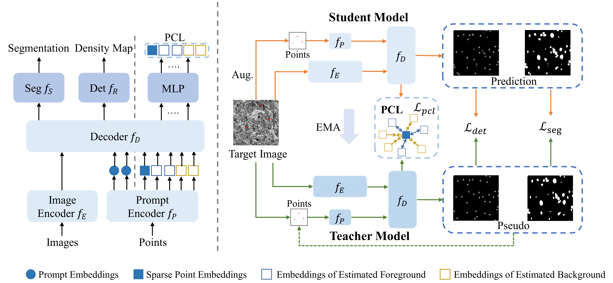

# Prompt-DAS
The official code repository for the Miccai 2025 accepted paper:

Prompt-DAS: Annotation-Efficient Prompt Learning for Domain Adaptive Semantic Segmentation of Electron Microscopy Images

<!-- This repository is the official implementation of [My Paper Title](https://arxiv.org/abs/2030.12345).  -->

<!-- >📋  Optional: include a graphic explaining your approach/main result, bibtex entry, link to demos, blog posts and tutorials -->

## Requirements

To install requirements:

```setup
pip install -r requirements.txt
```

## Datasets：
Download MitoEM dataset（MitoEM-Human and MitoEM-Rat）https://mitoem.grand-challenge.org/

Organize the dataset into the following directory structure：  

```plaintext
dataset/
├── H/            
│   └─ test/              
│       ├── img
│       │    ├── im0400.png
│       │    └── ....
│       └── lab
│            ├── im0400.png
│            └── ....
└── R/                  
    └─ test/
        ├── img
        │    ├── im0400.png
        │    └── ....
        └── lab
             ├── im0400.png
             └── ....

```
## Download Checkpoint
Click the links below to download the checkpoint for the corresponding dataset.

[R-H.pth](https://pan.baidu.com/s/1DBBxVu3V4OQT8_M3hKAJWA?pwd=shmk)

[H-R.pth](https://pan.baidu.com/s/1R66efgyDYessGQ_pWjQGLw?pwd=ynkv)

## Training
Todo
<!-- To train the model(s) in the paper, run this command:

```train
python train.py --input-data <path_to_data> --alpha 10 --beta 20
```

>📋  Describe how to train the models, with example commands on how to train the models in your paper, including the full training procedure and appropriate hyperparameters. -->

## Evaluation
To evaluate my model on R/H, run:

```eval
python Evaluation.py
```

<!-- >📋  Describe how to evaluate the trained models on benchmarks reported in the paper, give commands that produce the results (section below). -->

<!-- ## Pre-trained Models -->

<!-- You can download pretrained models here:

- [My awesome model](https://drive.google.com/mymodel.pth) trained on ImageNet using parameters x,y,z. 

>📋  Give a link to where/how the pretrained models can be downloaded and how they were trained (if applicable).  Alternatively you can have an additional column in your results table with a link to the models. -->

<!-- ## Results

Our model achieves the following performance on :

### [Image Classification on ImageNet](https://paperswithcode.com/sota/image-classification-on-imagenet)

| Model name       | Top 1 Accuracy | Top 5 Accuracy |
| ---------------- | -------------- | -------------- |
| My awesome model | 85%            | 95%            |

>📋  Include a table of results from your paper, and link back to the leaderboard for clarity and context. If your main result is a figure, include that figure and link to the command or notebook to reproduce it.  -->


<!-- ## Contributing

>📋  Pick a licence and describe how to contribute to your code repository.  -->